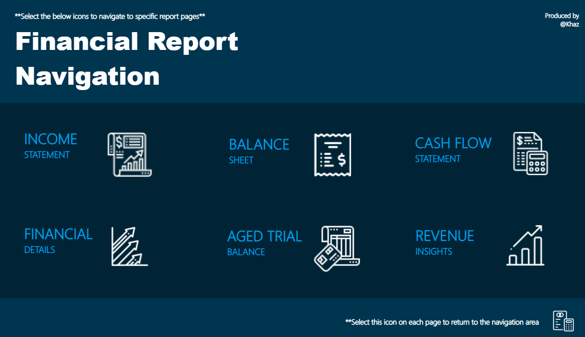
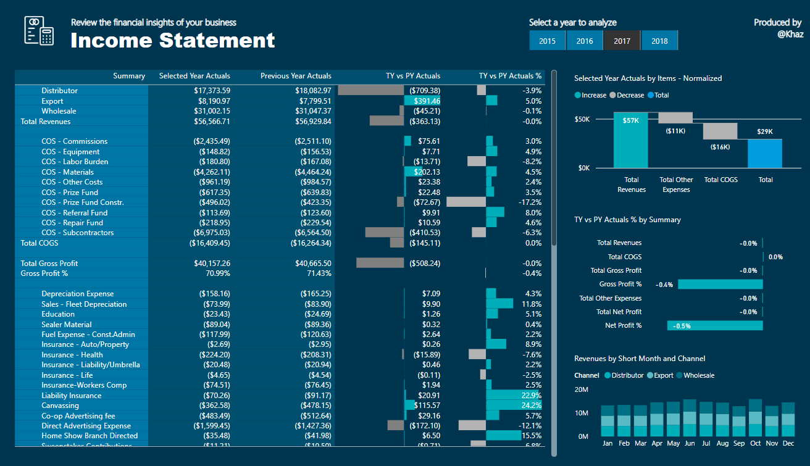
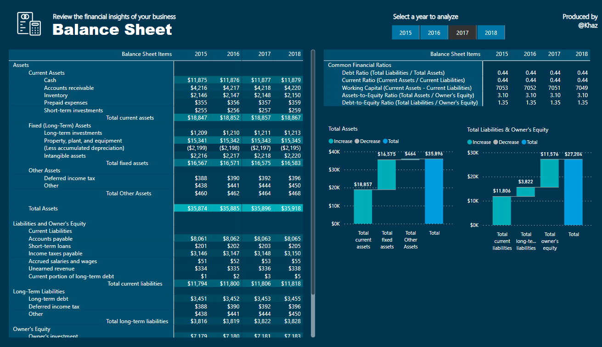
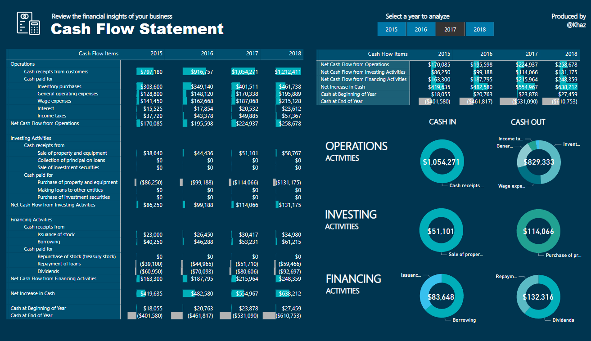
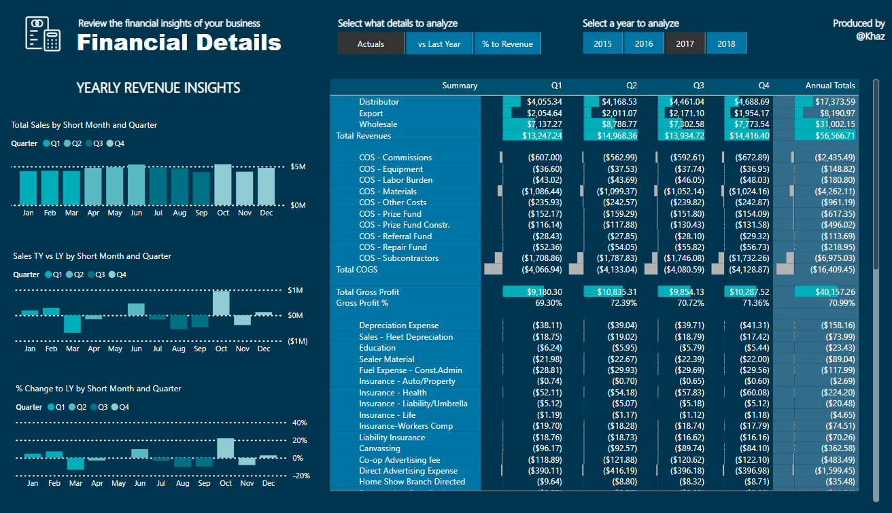
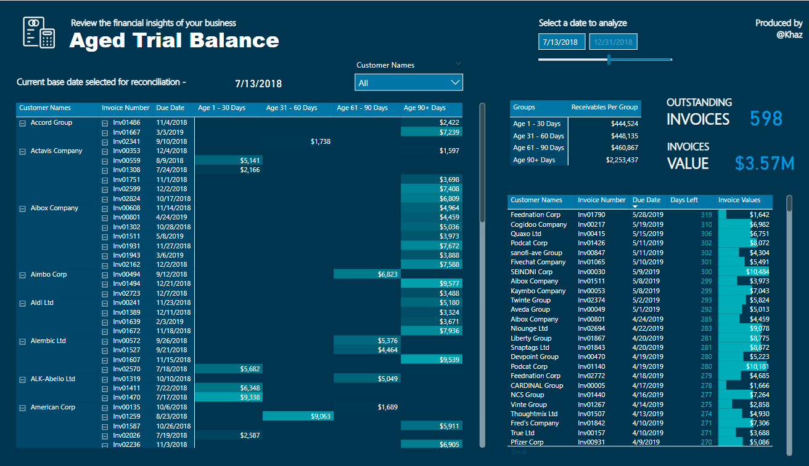
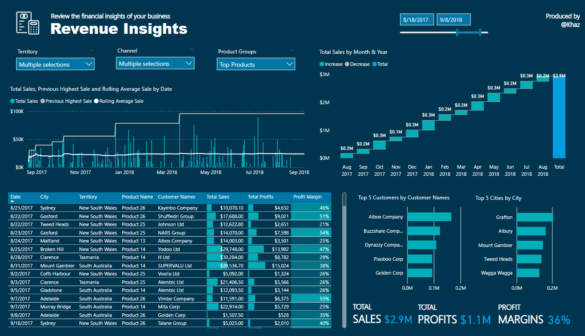

# Financial Reporting with Power BI
Here is my project as Data Engineer in Financial Reports that represent key and actionable insights with Power BI

## Project Preview

### Income Statement

### Balance Sheet

### Cash Flow Statement

### Financial Details

### Aged Trial Balance

### Revenue Insights

